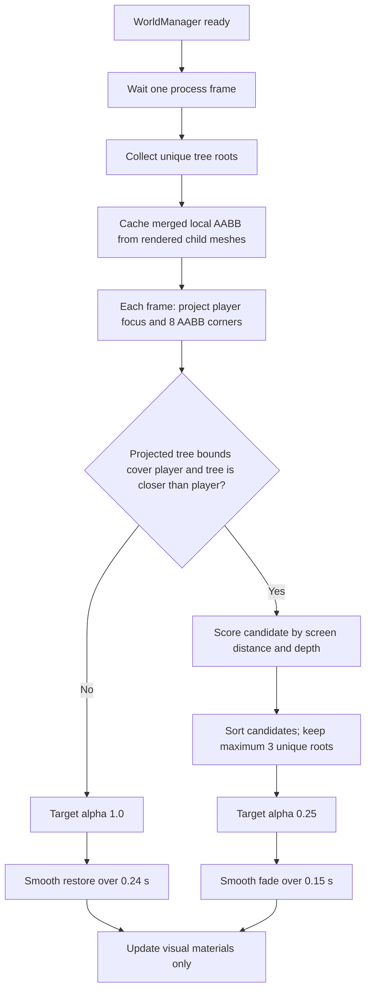

# Tree Occlusion & Player Readability — Design Contract

> **Status:** Mandatory rule for every AI agent and developer modifying trees, camera, lighting, shaders, materials, world generation, or player readability.
>
> **Owner intent:** This behavior is a core visual-design decision. Do not simplify, remove, or replace it without explicit user approval.

## 1. Player-facing requirement

The game uses the existing orthographic camera. When rendered tree geometry lies between the camera and the player's on-screen silhouette, the complete visual root of that tree fades so the player remains readable.

The system must preserve all of these invariants:

- Fade the **whole visual tree**, not only one canopy mesh or one child surface.
- Target alpha is exactly **0.25**.
- Fade-out reaches the target in **0.15 seconds**.
- Fade-in restores opacity in **0.24 seconds** to avoid visual popping.
- Fade at most **3 unique tree roots** simultaneously.
- Keep the tree's collider active. Fading must never change collision or navigation.
- Keep nearby tree shadows active according to the shadow budget; fading must not directly disable shadows.
- Use screen-space geometry overlap, not a hardcoded world-axis rule.
- Player receives the shared actor fill plus a subtle player-only accent. Enemy receives only the shared fill.
- The player-only accent must remain weaker than the shared actor fill.

## 2. Authoritative implementation

The authoritative runtime is in:

- `src/world/world_manager.gd`
  - `_collect_trees()`
  - `_register_tree_for_fade()`
  - `_compute_tree_local_bounds()`
  - `_update_tree_fade(delta)`
  - `_tree_occlusion_score(...)`
  - `_set_tree_alpha_smooth(...)`
  - `_set_tree_alpha(...)`
  - `_update_tree_shadow_budget(delta)`
- `src/world/wind_sway.gdshader`
  - `alpha_multiplier`
  - screen-door discard in `fragment()`
- `src/world/forest_builder.gd`
  - `_create_wind_material(...)`
  - `_apply_wind_shader(...)`
- `src/lighting/lighting_director.gd`
  - actor/player readability light masks
- `src/player/player.gd`
  - player render layers
- `src/world/orc_mob.gd`
  - enemy render layers

Do not introduce a second competing tree-fade controller in another node or scene.

## 3. Required detection flow



### Why screen-space AABB is mandatory

The camera is orthographic and rotated. A rule such as `diff_z < 0`, distance to player, or a fixed X/Z corridor does not represent what the player actually sees. Projected mesh bounds are camera-orientation independent and work with trees of different scale, rotation, and canopy shape.

The bounds are cached when trees are collected. Do not recompute mesh AABBs every frame.

## 4. Tree identity and collection rules

- Register the generated tree root carrying group `trees` or the intended `Pine_` root.
- After registering a root, do not recursively register its visual descendants.
- One visible tree must consume only one slot of the 3-tree fade budget.
- Collection occurs in `_ready()` after one process frame, once procedural forest children exist.
- It must not depend on debug weather keys, storm activation, or player movement.
- Invalid/freed tree references must be skipped safely.

## 5. Material and shader rules

- Tree fade uses `alpha_multiplier` on the wind `ShaderMaterial`.
- Use deterministic screen-door discard so stacked branches at one pixel share the same decision. Conventional blended alpha makes layered foliage appear almost opaque and introduces sorting artifacts.
- Preserve the source material's albedo, normal, roughness, metallic, AO, and UV1 values when building the wind material.
- Do not replace tree PBR materials with a flat-color transparency material.
- BaseMaterial fallback is allowed only for tree meshes that do not use the wind shader.
- Do not set `tree.visible = false`, alpha `0.0`, or disable an entire tree merely because it covers the player.

## 6. Collider and shadow contract

Visual opacity, collision, and shadow participation are separate concerns:

- Fade changes material opacity only.
- StaticBody3D/CollisionShape3D state remains untouched.
- Nearby shadows are controlled by the independent performance budget:
  - maximum 24 nearest tree roots;
  - maximum distance 28 m from player;
  - refresh every 0.35 seconds.
- A faded nearby tree may still cast a shadow. This is intentional and preserves scene grounding.

## 7. Lighting hierarchy contract

Render/light masks protect gameplay readability without flattening the whole scene:

- World geometry: layer/mask `1`.
- Shared combat actor fill: layer/mask `2`.
- Player-only accent: layer/mask `4`.
- Player sprite receives `1 | 2 | 4`.
- Enemy sprite receives `1 | 2`, never player layer `4`.
- Readability lights cast no extra shadows.
- The player accent is a small hierarchy step, not a glow or outline that dominates the art.

## 8. Forbidden regressions

Agents must not:

- Restore the legacy `diff_x`, `diff_z`, or fixed-distance heuristic.
- Fade based only on tree origin; a tall canopy can cover the player while its origin is far away.
- Register both a generated root and its `Pine_*` child.
- Hide all trees along an infinite camera ray.
- Fade more than 3 trees at once.
- use an instant alpha jump in normal gameplay;
- modify or disable tree colliders during fade;
- remove the screen-door shader and return to layered blend transparency;
- make player and enemy readability lighting identical;
- change the orthographic camera to solve occlusion;
- silently change constants in this document.

## 9. Required regression tests

Any change touching this system must keep or extend:

- `src/tests/cases/test_tree_fade_tier1.gd`
- `src/tests/cases/test_tree_fade_tier2.gd`
- `src/tests/cases/test_lighting_tier1.gd`
- `test_player_movement_tree_fade()` in `src/tests/cases/test_interactions_tier3.gd`

Minimum command set:

```powershell
$env:E2E_TEST_FILTER='tree_fade'
D:\Godot\godot_console.exe --headless --path . --script res://src/tests/test_runner.gd

$env:E2E_TEST_FILTER='lighting_tier1'
D:\Godot\godot_console.exe --headless --path . --script res://src/tests/test_runner.gd

$env:E2E_TEST_FILTER='interactions_tier3'
$env:E2E_TEST_METHOD_FILTER='player_movement_tree_fade'
D:\Godot\godot_console.exe --headless --path . --script res://src/tests/test_runner.gd
```

Also inspect one 1920×1080 gameplay frame with the player behind a real generated tree. Unit tests alone do not validate final silhouette readability or dither quality.

## 10. Change-control checklist

Before modifying this design, an agent must:

1. Explain why the existing screen-space approach fails the new requirement.
2. Present trade-offs for scalability, maintainability, security, performance, and user experience.
3. Obtain explicit user approval for any changed invariant.
4. Update this document and all affected tests in the same change.
5. Verify the orthographic camera, clear/rain/storm profiles, and both Cinematic/Performance presets.

| Dimension | Current decision | Accepted trade-off |
|---|---|---|
| Scalability | Cache AABB once; project 8 corners for each tree | O(n) projection for ~105 trees is predictable; only 3 trees receive fade targets |
| Maintainability | One controller in `WorldManager` with explicit constants | Centralized logic is easier to protect and test than per-tree scripts |
| Security | No external input, file access, or dynamic code | No additional attack surface; invalid nodes are checked before access |
| Performance | 3-fade cap plus 24-tree shadow budget | Far tree shadows are sacrificed before player readability or local grounding |
| User experience | 0.15 s fade-out, 0.24 s restore, alpha 0.25 | Player stays readable without making the forest disappear or pop |
