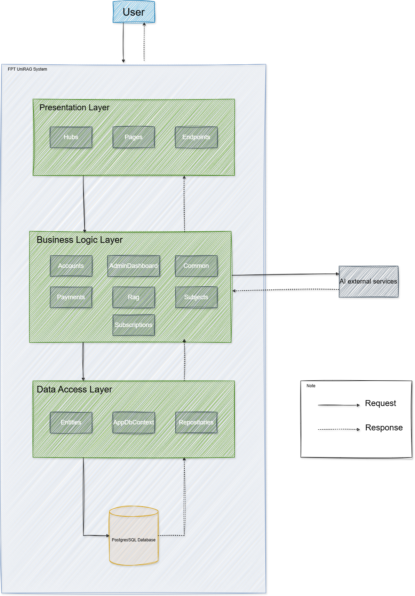

<div align="center">

# 🎓 FPT UniRAG

### Academic AI Assistant for Course Materials

<p>
  
  
  
  
  
  
</p>

<p>
  <strong>Chat with course materials · Manage subjects · Process academic documents</strong>
</p>

</div>

<div align="center">

<a href="#-highlights">Highlights</a> ·
<a href="#-architecture">Architecture</a> ·
<a href="#first-time-setup">Setup</a> ·
<a href="#-important-routes">Routes</a>

</div>

FPT UniRAG is an academic AI assistant for FPT University. Students chat with course material, teachers upload and process documents, and administrators manage subjects, accounts, subscription plans, quotas, and embedding configuration.

The application is a three-project ASP.NET Core Razor Pages solution backed by PostgreSQL, OpenRouter, Stripe, and SignalR.

## ✨ Highlights

- 🤖 RAG-powered student chat with course citations
- 📚 Teacher document upload, extraction, chunking, and embedding workflow
- 👨‍💼 Admin management for accounts, subjects, plans, quotas, and analytics
- ⚡ Realtime subject, plan, quota, and chat updates with SignalR
- 💳 Stripe Sandbox subscription checkout
- 🔐 Role-based access for students, teachers, and administrators

## 🧰 Tech stack

| Layer | Technology |
|---|---|
| Web application | ASP.NET Core 10 Razor Pages |
| Business logic | .NET class library |
| Data access | Entity Framework Core 10 + Npgsql |
| Database | PostgreSQL 17 |
| AI providers | OpenRouter embeddings and chat completion |
| Realtime | ASP.NET Core SignalR |
| Payments | Stripe Sandbox |
| Infrastructure | Docker Compose |
| OCR | Tesseract OCR (optional) |

## 🏗️ Architecture



Requests enter the presentation layer through Razor Pages, minimal API endpoints, or SignalR hubs. The presentation project calls services in the business layer, which coordinates authentication, account and subject management, subscriptions, document processing, RAG, and reporting. Repositories in the data access layer use `AppDbContext` to access PostgreSQL. OpenRouter and Stripe are called from the business layer; SMTP and optional Tesseract OCR are additional integrations used by account provisioning and document extraction.

The dependency direction is:

```text
FPTUniRAG (Presentation) -> FPTUniRAG.BusinessLayer -> FPTUniRAG.DataAccessLayer
```

## Project context

### Main users

- **Student**: selects subjects, chats with course content, views subscription plans, and purchases a plan through Stripe Sandbox.
- **Teacher**: works with subjects assigned as header teacher, uploads documents, and monitors document processing.
- **Admin**: manages users, subjects, teacher assignments, subscription plans, free student quota, embedding configuration, and analytics.

### Main capabilities

- Custom cookie authentication with `admin`, `teacher`, and `student` roles.
- RAG chat pipeline:
  1. Student chooses a subject.
  2. Relevant chunks are retrieved from embedding records stored in PostgreSQL.
  3. OpenRouter generates the answer with course citations.
  4. The student chat API returns session data and streams the generated answer to the browser.
- Teacher document workflow for upload, extraction, fixed or semantic chunking, PostgreSQL vector embedding, and queued background processing.
- Admin CRUD for subjects and subscription plans.
- Stripe Sandbox product/price synchronization and checkout.
- Database-backed monthly free-token quota for students without an active paid plan.
- SignalR realtime updates for:
  - teacher subject assignments and subject changes;
  - subscription plan create, update, activate/deactivate, and delete;
  - free student quota changes;
  - student chat events.

## Repository structure

```text
FPTUniRAG/
├── FPTUniRAG/                  # Presentation: Razor Pages, endpoints, hubs, startup
├── FPTUniRAG.BusinessLayer/    # Application services, RAG, payments, notifications
├── FPTUniRAG.DataAccessLayer/  # EF Core context, entities, repositories
├── create_database.sql         # PostgreSQL bootstrap schema
├── docker-compose.yml          # PostgreSQL container
├── prn222.drawio.png           # Layered architecture diagram
└── FPTUniRAG.slnx              # Solution file
```

## Requirements

- Windows, macOS, or Linux
- Docker Desktop and Docker Compose
- Git
- Optional: API credentials for OpenRouter, SMTP, and Stripe Sandbox

## First-time setup

### 1. Clone and enter the repository

```bash
git clone <repository-url>
cd FPTUniRAG
```

### 2. Start the complete application

```bash
docker compose up
```

Docker Compose builds the .NET 10 web image, installs Tesseract OCR, initializes PostgreSQL, seeds the default accounts, and starts the application. Open:

```text
http://localhost:5056
```

Run in the background when preferred:

```bash
docker compose up -d
docker compose ps
```

The default services are:

| Service | Address |
|---|---|
| FPTUniRAG web | `http://localhost:5056` |
| PostgreSQL | `localhost:54329` |

`create_database.sql` is the single source of truth for the current PostgreSQL schema. The Docker bootstrap runs it automatically when the PostgreSQL volume is created for the first time.

### 3. Enable optional integrations

The core application starts without external credentials. To enable AI chat/embeddings, credential email, and Stripe checkout, copy the environment template and fill in the required secrets:

```bash
cp .env.example .env
docker compose up -d
```

PowerShell equivalent:

```powershell
Copy-Item .env.example .env
docker compose up -d
```

Never commit the resulting `.env` file. The Docker build also excludes local `appsettings.json`, `.env`, Data Protection keys, and uploaded documents.

### Existing database schema

Docker init scripts only run for a new PostgreSQL volume. For an existing local database, apply the consolidated schema manually from PowerShell:

```powershell
Get-Content create_database.sql -Raw | docker exec -i fptunirag-postgres psql -U postgres -d prn222
```

From Bash, use `docker exec -i fptunirag-postgres psql -U postgres -d prn222 < create_database.sql`.

The schema includes subject chunking settings, embedding settings, document embedding runs, processing progress, Stripe subscription IDs, and the student free-quota setting.

## Default accounts

On startup, the hosted initialization service creates or updates these local development accounts:

| Role | Email | Password |
|---|---|---|
| Admin | `admin@fpt.edu.vn` | `Admin@123` |
| Student | `student@fpt.edu.vn` | `Student@123` |

Override these values through `.env` before sharing or deploying the application.

## Important routes

| Route | Access | Purpose |
|---|---|---|
| `/` | Public | Login page |
| `/AdminDashboard` | Admin | Admin dashboard |
| `/Accounts` | Admin | Manage student and teacher accounts |
| `/Subjects` | Admin | Subject CRUD and assignments |
| `/Analysis` | Admin | Subscription and token-usage analytics |
| `/SubscriptionPlans` | Admin | Manage paid plans |
| `/FreeQuotaSettings` | Admin | Configure free monthly student tokens |
| `/EmbeddingSettings` | Admin | Select active embedding model |
| `/EmbeddingBenchmark` | Admin | Run and inspect embedding benchmarks |
| `/TeacherHome` | Teacher | Header subject dashboard |
| `/TeacherUpload` | Teacher | Upload course documents |
| `/TeacherDocuments` | Teacher | Manage uploaded documents and chapters |
| `/StudentDashboard` | Student | AI chat workspace |
| `/StudentPlans` | Student | View and purchase plans |
| `/ChangePassword` | Authenticated | Change the current account password |

## Configuration notes

- The free student token limit defaults to `2,000` tokens per month if the quota table is unavailable or has no valid value.
- Paid students use the monthly token limit stored on their active subscription plan.
- `StorageRoot` defaults to `App_Data/teacher-uploads` for private teacher uploads.
- Supported upload types are `.docx`, `.txt`, `.md`, and `.pdf`.
- Tesseract OCR is controlled by `RagIngestion:Tesseract`.
- `appsettings.Development.json` overrides values from `appsettings.json` when the environment is `Development`.

## Troubleshooting

### Startup fails while creating the default admin/student

Check that PostgreSQL is running and that the connection string points to port `54329`:

```bash
docker compose ps
docker exec -it fptunirag-postgres psql -U postgres -d prn222 -c "select 1;"
```

If the error mentions a missing column or table, reapply the consolidated `create_database.sql` schema to the existing `prn222` database.

### PostgreSQL schema changes do not appear

Docker init scripts run only for a new volume. Apply the required script manually, or recreate the local database volume when it is safe to discard local data.

### Student does not see realtime changes

Confirm that:

1. The student page is connected to `/hubs/subscription-plans`.
2. The browser is authenticated as a student.
3. The admin operation completed successfully.
4. The application process was rebuilt/restarted after code changes.

### Stripe checkout fails

Verify `Stripe:SecretKey` is a Stripe Sandbox key beginning with `sk_test_`, and that `Stripe:PublicBaseUrl` matches the HTTPS development URL.

### OpenRouter requests fail

Verify `RagIngestion:OpenRouter:ApiKey`, model names, embedding dimensions, and network access.

## Development commands

```bash
# Native .NET build (optional)
dotnet build FPTUniRAG.slnx

# Native .NET run (optional)
dotnet run --project FPTUniRAG/FPTUniRAG.csproj --launch-profile https

# Build and start the complete Docker stack
docker compose up --build

# Start in the background
docker compose up -d

# Stop infrastructure
docker compose down

# View service status
docker compose ps

# Follow all logs
docker compose logs -f

```

## Security notes

- Never commit local `appsettings.json` or secret keys.
- Use environment variables, user secrets, or a production secret manager for deployment.
- The default passwords are for local development only.
- Do not expose the PostgreSQL port publicly without authentication and network controls.
